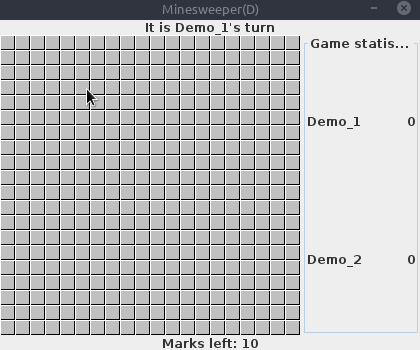

# Minesweeper game

Primary goal of this project is to learn OOP concepts by building game with different complexity levels.

Project built using Java's built-in Swing library

**Game is divided into 4 different levels:**
* **Level A** - Simple console minesweeper game.
* **Level B** - Extension of level A, with UI interface.
* **Level C** - Extension of level B, with multiplayer mechanism
* **Level D** - Extension of level C, with ability to modify number of rows, columns and bombs for playing board.



Final version of game(Level D) has the following **functionality:**
* Display an image of a bomb if player hits tile containing bombs.
* Support of 2 player contest mode.
* Track game statistics with the count of uncovered tiles for each player.
* Track players' turn to uncover tiles.
* Track the number of non-utilized flags(marks) for denoting position of bombs.
* Display the number of bombs in surrounding squares if the player clicks the left mouse otherwise.
* Works for a board of any size or shape (customisation)
* Display a red flag if the player right-clicks on tile.
* Uncover tiles containing the bombs if one of the players fails the game.


### Instructions

**Project can be run with 2 different ways:**


* **Run using jar file**

Executable JAR file located inside **dist** folder, to run it you need to open terminal inside this folder and run the following command:

```
    java -jar Minesweeper_game.jar
```

<br />

* **Run using source code**

The source code is located inside the **src** folder. 

To run level picker, you have to run Main class inside the **src** folder.

Otherwise, each level of the game can be run separately, each folder inside src belongs to dedicated level's package. To run level separately(without level picker) you have to run main method for specific level.

Main methods located in following files:
* src/LvlA/LvlA.java
* src/LvlB/MineSweeperMain.java
* src/LvlC/MainFrame.java
* src/LvlD/MainFrameD.java
